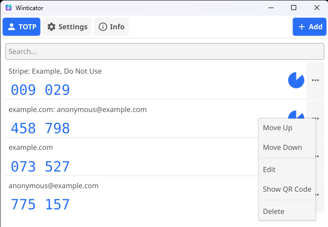
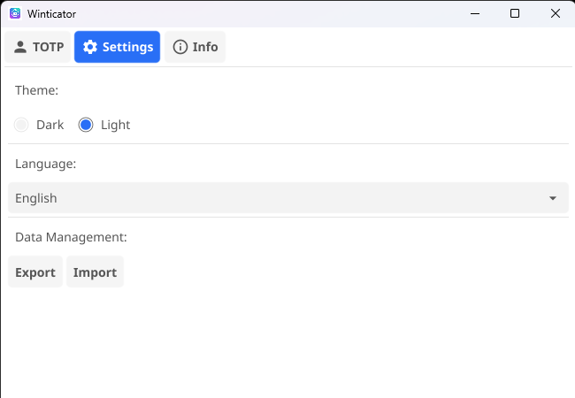
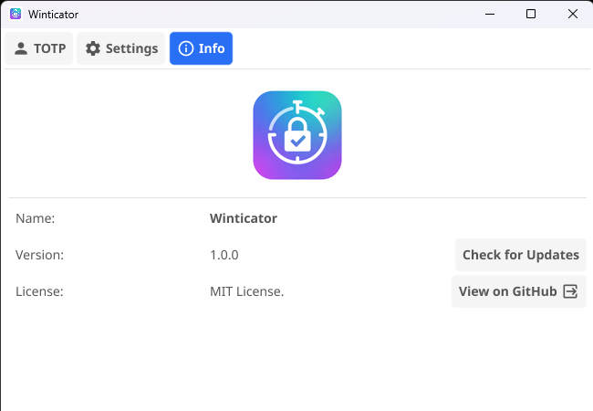
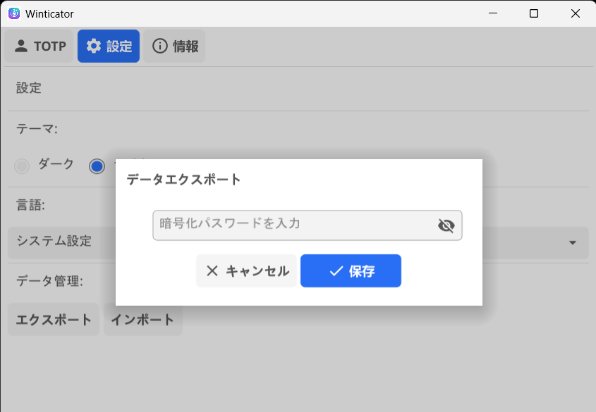

# Winticator

[](https://github.com/nktmys/winticator/blob/main/go.mod)
[](https://github.com/nktmys/winticator/releases/latest)
[](https://github.com/nktmys/winticator/releases) 
[](https://github.com/nktmys/winticator/actions/workflows/test.yaml)

[English](./README.md) | 日本語

`Winticator` は、デスクトップ環境（Windows / macOS / Linux）で動作する**TOTP 認証アプリケーション**の、独立したオープンソース実装です。クロスプラットフォーム対応のリファレンスアプリケーションとして実装されています。

本プロジェクトは、公開標準に基づいたスタンドアロン型・クロスプラットフォームデスクトップアプリケーションをどのように構築・配布できるかを示す**技術的デモンストレーション**を目的としています。

---

## 概要

- Windows / macOS / Linux に対応したクロスプラットフォームデスクトップアプリケーション
- 公開標準 **TOTP（RFC 6238）** に基づく実装
- 完全オフライン動作（ネットワーク通信なし）
- シンプルかつ最小限の機能構成
- **MIT License** に基づくオープンソースソフトウェアとして公開

Winticator は**技術的な実装方法や可搬性**に重点を置いており、製品としての差別化や商用利用を目的としていません。

---

## 機能

- **QRコードスキャン** — **追加**ボタンを押すだけで、画面からTOTP用QRコードをスキャンし自動検出
- **Google Authenticatorインポート** — `otpauth-migration://` QRコードによる一括インポート
- **バックアップ・リストア** — 独自のパスワード保護されたバックアップファイルでのエクスポート・インポート
- **完全オフライン** — ネットワーク通信なし。すべてのデータは端末内に保持
- **クリップボードにコピー** — エントリをタップしてOTPコードをクリップボードにコピー。有効期限後にクリップボードを自動クリア
- **QRコード表示** — 各エントリをQRコードとして表示し、他のデバイスに転送可能

---

## 対応URIスキーム

| スキーム | 説明 |
|----------|------|
| `otpauth://` | 個別エントリ追加用の標準TOTP URI形式（RFC 6238） |
| `otpauth-migration://` | 一括インポート用のGoogle Authenticatorエクスポート形式 |

> **注意:** `otpauth-migration://` のQRコードは、エントリ数が多いとデータが密集し、デコードに失敗する場合があります。
> スキャンに失敗した場合は、表示スケールを変更して再度スキャンするか、エクスポート元アプリから1件ずつエクスポートしてください。

---

## Screenshots

| TOTP List | Settings |
|:---------:|:--------:|
|  |  |

| App Info | Export |
|:--------:|:------:|
|  |  |

---

## ダウンロード

お使いのプラットフォーム用のバイナリを[リリースページ](https://github.com/nktmys/winticator/releases/latest)からダウンロードできます。

| プラットフォーム | アーキテクチャ | ファイル |
|------------------|----------------|----------|
| Windows | x64 (amd64) | `winticator-windows.zip` |
| macOS | Apple Silicon (arm64) | `winticator-macos.zip` |
| Linux | x64 (amd64) | `winticator-linux.tar.xz` |

**他のアーキテクチャのバイナリをご希望の場合は、[issue](https://github.com/nktmys/winticator/issues)でお気軽にご連絡ください。**

---

## プロジェクトの目的

このプロジェクトの主な目的は以下の通りです：

- **クロスプラットフォームなデスクトップアプリケーション**を構築するための実践的なアプローチを示すこと
- デスクトップ環境におけるTOTP認証アプリケーションの**リファレンス実装**を提供すること
- **公開されている標準仕様や情報**を活用した実装知識を共有すること

このプロジェクトは**商用プロダクトとしての提供を目的としたものではなく**、既存のサービスやアプリケーションと競合・代替する目的としていません。

---

## 準拠規格および参照情報

Winticator は、以下のような**公開資料のみ**に基づいて実装されています：

- RFC 6238：Time-Based One-Time Password Algorithm
- TOTPに関するの公開ドキュメントおよび仕様
- オープンソースのリファレンス実装

特定の企業や組織が保有する**独自アルゴリズム、設計情報、内部仕様等は一切使用していません**。

---

## 非提携に関する免責事項

Winticator は**独立したプロジェクト**です。

- **Google社とは一切の提携・関係・承認を受けていません**
- **特定の企業・団体との提携・関係・承認もありません**
- 記載されている製品名やサービス名は、説明目的でのみ使用されています

---

## 範囲と制限事項

このプロジェクトは、意図的にシンプルかつ中立な構成としています：

- 機能は最小限に限定しています
- 高度なユーザビリティ、企業向け機能、サービス連携等は対象外です
- 他の認証アプリケーションとの比較、評価を目的としていません

このプロジェクトの目的は、**明確さとシンプルさ**であり、機能の網羅性ではありません。

---

## ライセンス

このプロジェクトは**MITライセンス**のもとで公開されています。

ライセンス条項に従う限り、商用利用を含め、自由に使用・改変・再配布・組み込むことができます。

詳細は[LICENSE](./LICENSE)ファイルをご参照ください。

---

## トラブルシューティング

### macOS: 「アプリが壊れている」または開けない場合

macOSでアプリを起動しようとした際に、以下のようなエラーメッセージが表示されることがあります：
- 「"Winticator"は壊れているため開けません」
- 「開発元を検証できないため"Winticator"を開けません」

これはmacOSのGatekeeper検疫機能によるものです。以下のコマンドをターミナルで実行して解決できます：

```bash
xattr -r -d com.apple.quarantine /Applications/Winticator.app
```

`/Applications/Winticator.app`はアプリの実際の配置場所に合わせて変更してください。

### macOS: QRコードスキャンが動作しない場合

「画面収録とシステムオーディオ録音」の権限を有効にしているにもかかわらず、QRコードスキャンが動作しない場合、権限が正しく機能していない可能性があります。

以下の手順で解決できます：
1. **システム設定** → **プライバシーとセキュリティ** → **画面収録とシステムオーディオ録音** を開く
2. **−**（マイナス）ボタンをクリックしてWinticatorをリストから削除する
3. 再度Winticatorを追加し、権限を有効にする

これにより、QRコードスキャンに必要な画面キャプチャ機能が復旧します。

---

## 注意事項

このプロジェクトは **現状のまま（as is）** で提供され、いかなる保証も伴いません。

実運用や企業利用を前提としたプロダクションレベルのソリューションをお探しの場合は、公式なサポートを提供している既存の製品・サービスをご検討ください。
