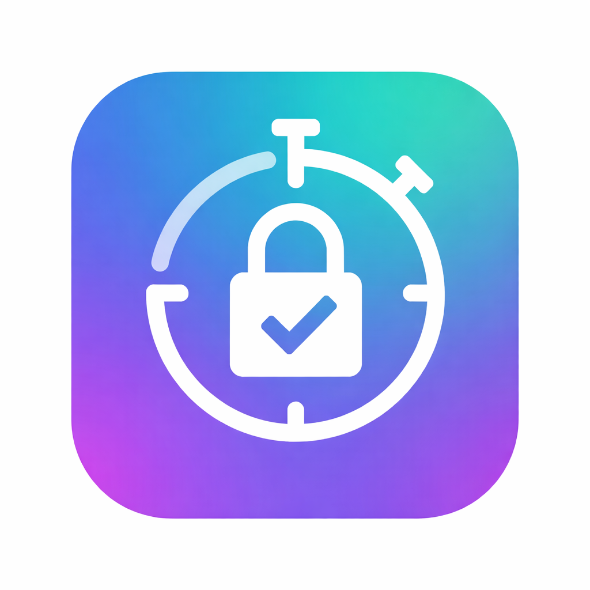

# Winticator

 
 
 

English | [日本語](./README-ja.md)

`Winticator` is an independent, open-source TOTP authenticator for desktop environments
(Windows / macOS / Linux), implemented as a cross-platform reference application.

This project is intended as a **technical demonstration** of how to build and distribute
a standalone, cross-platform desktop application based on open standards.

---

## Overview

- Cross-platform desktop authenticator (Windows / macOS / Linux)
- Based on the open standard **TOTP (RFC 6238)**
- Works entirely offline (no network communication)
- Designed as a simple, minimal implementation
- Released as **MIT licensed open-source software**

Winticator focuses on **technical implementation and portability**,
not on product differentiation or commercial use.

---

## Purpose of This Project

The primary purpose of this project is:

- To demonstrate a practical approach for building **cross-platform desktop applications**
- To provide a **reference implementation** of a TOTP authenticator on desktop environments
- To share implementation knowledge using **publicly available standards and information**

This project is **not intended to be a commercial product**,
nor to compete with or replace any existing services or applications.

---

## Standards and References

Winticator is implemented based solely on publicly available materials, including:

- RFC 6238: Time-Based One-Time Password Algorithm
- Public documentation and specifications of TOTP
- Open-source reference implementations

No proprietary algorithms, designs, or internal specifications from any organization
are used in this project.

---

## Non-Affiliation Disclaimer

Winticator is an **independent project**.

- It is **not affiliated with, endorsed by, or associated with Google**
- It is **not affiliated with, endorsed by, or associated with any specific company**
- Any product or service names mentioned are used solely for descriptive purposes

---

## Scope and Limitations

To keep the project intentionally simple and neutral:

- The feature set is minimal
- Advanced usability, enterprise features, or service integrations are out of scope
- No comparison with other authenticator applications is intended

The goal is **clarity and simplicity**, not feature completeness.

---

## License

This project is licensed under the **MIT License**.

You are free to use, modify, distribute, and incorporate this software,
including for commercial purposes, under the terms of the license.

See the [LICENSE](./LICENSE) file for details.

---

## Notes

This project is provided "as is", without warranty of any kind.

If you are looking for a production-grade or enterprise-ready solution,
please consider established products or services that provide official support.
